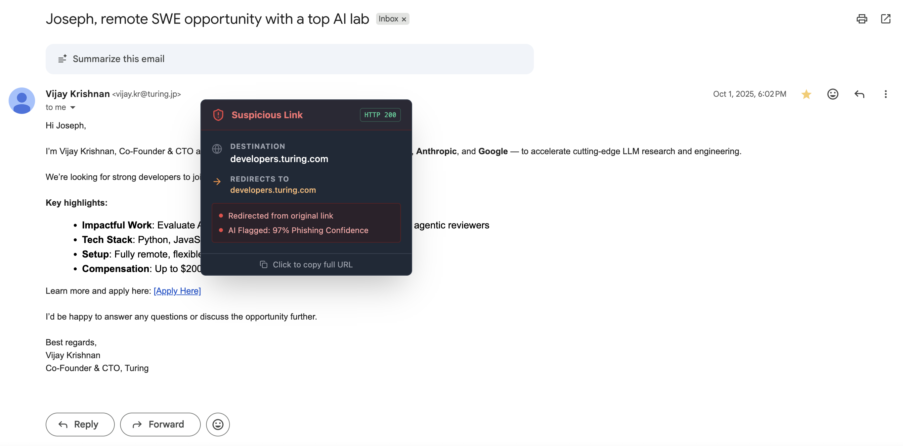

# SafeLink HoverGuard 🛡️

> **A smart Chrome Extension that uses a hybrid defense system—including a local AI Machine Learning model—to preview and evaluate the safety of links before you click.**

[](https://reactjs.org/)
[](https://www.typescriptlang.org/)
[](https://www.python.org/)
[](https://flask.palletsprojects.com/)
[](https://scikit-learn.org/)
[](https://tailwindcss.com/)

## See it in Action

| **AI-Powered Phishing Detection** | **Smart Redirect Unfurling** |
|:---------------------------------:|:----------------------------:|
|  |  |
| *The local Python model detects high-risk URL patterns (97% confidence) in real-time.* | *Detects when a link redirects to a different domain than expected.* |

---

## Why SafeLink?

Phishing attacks are getting smarter. Traditional security relies on "blacklists" (like Google Safe Browsing), which are accurate but reactive—they only catch threatening sites *after* they have been reported.

**SafeLink HoverGuard takes a "Defense-in-Depth" approach.** It combines traditional checks with a proactive **AI analysis engine** that examines the lexical structure of a URL in milliseconds to flag suspicious patterns (like high entropy, excessive hyphens, or IP address hosts) used in zero-day phishing attacks.

## Key Features

* **🤖 AI-Powered Phishing Detection:** A local Python backend uses a trained **Random Forest** classifier to analyze URL text patterns and assign a risk confidence score.
* **🕵️‍♂️ Instant Link Preview:** Hold `Shift` and hover over any link to see a detailed safety card.
* **🔄 Redirect Unfurling:** Automatically resolves shortened links (e.g., `bit.ly`) to reveal the final destination URL.
* **🌐 Domain & Protocol Inspection:** Clearly highlights the target domain and warns if the site is unsecure (HTTP).
* **🛡️ Google Safe Browsing Integration:** Cross-references URLs against Google's known threat database.
* **⚡ Blazing Fast:** The AI model runs locally on your machine for near-instant analysis without sending your browsing history to third-party servers.

---

## Architecture

SafeLink operates as a full-stack application comprised of two parts:

1.  **The Chrome Extension (Frontend):** Built with React, TypeScript, and Vite. It handles user interaction, injects the tooltip into webpages, and coordinates security checks in the background script.
2.  **The ML Server (Backend):** A lightweight Python Flask API that serves a scikit-learn Machine Learning model. It accepts URLs from the extension, extracts lexical features, and returns a phishing probability score.

---

## Installation & Setup Guide

Because this is a full-stack project, you need to set up both the Python backend and the Chrome extension frontend.

### Prerequisites

* Node.js (v16+) and npm
* Python (v3.8+) and pip
* Google Chrome browser

### Step 1: Set up the AI Backend

1.  Navigate to the ML server directory:
    ```bash
    cd ml_server
    ```
2.  Install Python dependencies:
    ```bash
    pip install flask flask-cors scikit-learn pandas joblib
    ```
3.  **Train the AI Model:** (Note: You must provide your own dataset named `dataset_phishing.csv` in this folder first).
    ```bash
    python3 train_model.py
    ```
4.  **Start the API Server:**
    ```bash
    python3 app.py
    ```
    *Keep this terminal window running. The server should listen on `http://0.0.0.0:5001`.*

### Step 2: Set up the Chrome Extension

1.  Open a new terminal window in the project root directory.
2.  Install JavaScript dependencies:
    ```bash
    npm install
    ```
3.  (Optional) Set up Google Safe Browsing: Create a `.env` file in the root and add your API key: `VITE_GOOGLE_SAFE_BROWSING_API_KEY=your_key_here`.
4.  Build the extension:
    ```bash
    npm run build
    ```
    *This creates a `dist` folder with the final extension files.*

### Step 3: Load into Chrome

1.  Open Chrome and navigate to `chrome://extensions`.
2.  Toggle **Developer mode** in the top right corner.
3.  Click **Load unpacked**.
4.  Select the `dist` folder generated in the previous step.

---

## How to Use

1.  Ensure your Python ML server (`app.py`) is running in a terminal.
2.  Navigate to any webpage (or open an email draft).
3.  **Hold down the `Shift` key and hover your mouse over a link.**
4.  The SafeLink tooltip will appear, showing the analysis results.

---

## License

Distributed under the MIT License. See `LICENSE` for more information.
